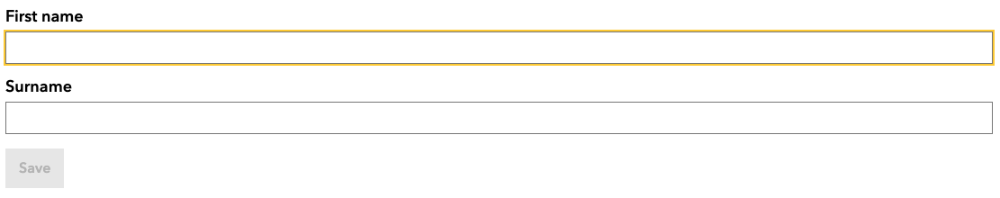
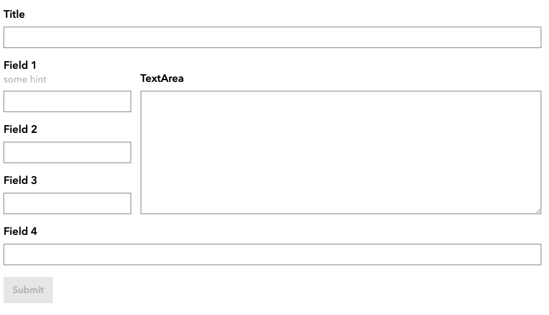
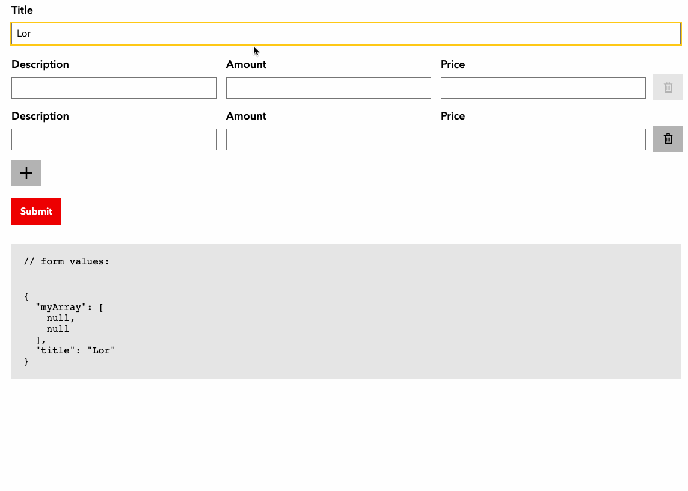

# Amsterdam react final form

Provides a way to generate a complete functional, but still customizable, amsterdam styled forms. 
Based on OpenApi specs.

## Demo

Please have a look at our storybook! 
- [Simple example](https://jeffrey-zutt.github.io/amsterdam-react-final-form/?path=/story/complete-form--example)
- [Complex data structure example](https://jeffrey-zutt.github.io/amsterdam-react-final-form/?path=/story/complete-form--example-using-complex-fields)
- [Responsive scaffolded grid](https://jeffrey-zutt.github.io/amsterdam-react-final-form/?path=/story/scaffold--complex-grid)

## Goals

- Aims to be as close to the [design system](https://designsystem.amsterdam.nl/) as possible.
- All fields should be able to render a: 
    * Label
    * Input control (`input`, `select`, `textarea`, etc.)
    * Error message 
- All fields should be as wide as their container.
- All fields should be able to render using a JSON. (Which can be generated) 
- All fields should be fully unit-tested.
- Form should be able to handle its state. No extra handling needed.

## Example

```tsx
import React from 'react'
import { ScaffoldForm, TextField, Button } from 'amsterdam-react-final-form'

const MyForm:React.FC = () => {
  const handleSubmit = useCallback((formValues) => console.log(formValues), [])  
  return (
     <ScaffoldForm onSubmit={handleSubmit}>                
         <TextField name='firstname' label='First name' />
         <TextField name='surname' label='Surname' />
         <Button variant='secondary' type='submit' />
     <ScaffoldForm>        
  )
```


## Scaffold example:

```tsx
import React from 'react'
import { ScaffoldForm, Scaffold, ScaffoldFields } from 'amsterdam-react-final-form'
import { FormPositioner } from 'amsterdam-scaffold-form'

// NOTE: You could generate these fields. 
// For instance, based on an OpenAPI spec.
 
const scaffoldFields:ScaffoldFields = {
  title: { 
    type: "TextField", 
    props: { label: "Title", name: "title" } 
  },
  field1: { 
    type: "TextField", 
    props: { label: "Field 1", name: "field1", hint: "some hint" } 
  },
  field2: { 
    type: "TextField", 
    props: { label: "Field 2", name: "field2" } 
  },
  field3: { 
    type: "TextField", 
    props: { label: "Field 3", name: "field3" } 
  },
  textarea: { 
    type: "TextAreaField", 
    props: { label: "TextArea", name: "textarea" } 
  },
  field4: { 
    type: "TextField", 
    props: { label: "Field 4", name: "field4" } 
  },
  submit: { 
    type: "SubmitButton", 
    props: { label: "Submit" } 
  }
}

// NOTE: Field positioning is handled using purely css. Using breakpoints and css-grid.
// We support all major browsers, including IE11. 

const scaffoldProps = new FormPositioner(scaffoldFields)
  
    .setVertical("mobileS")               // <- Render fields vertically in a single column for breakpoint "mobileS"
    
    .setGrid("laptop", "1fr 1fr", [       // <- Render fields in a grid with two equal columns for breakPoint "laptop". 
        ["title", "title"],               // <- Title is stretched over two columns 
        ["field1", "textarea"],           // <- TextArea is stretched over three rows
        ["field2", "textarea"],
        ["field3", "textarea"],
        ["field4", "field4"],             // <- Field4 is stretched over two columns
        ["submit"],
    ])
  
    .getScaffoldProps()                   // Get props for scaffold field
;

const MyForm:React.FC = () => {
  const handleSubmit = useCallback((formValues) => console.log(formValues), [])  
  return (
     <ScaffoldForm onSubmit={handleSubmit}>                
         <Scaffold {...scaffoldProps} />
     <ScaffoldForm>        
  )
}
```


## Scaffold example of an ArrayField

```tsx
import React from 'react'
import { ScaffoldForm, Scaffold, ScaffoldFields } from 'amsterdam-react-final-form'
import { FormPositioner } from 'amsterdam-scaffold-form'

// NOTE: You could generate these fields. 
// For instance, based on an OpenAPI spec.
 
const scaffoldFields:ScaffoldFields = {
  title: { 
    type: "TextField", 
    props: { label: "Title", name: "title" } 
  },
  arrayField: {
    type: "ArrayField",
    props: {
      name: "myArray",
      allowAdd: true,
      allowRemove: true,
      minItems: 1,
      scaffoldFields: {
           description: {
             type: "TextField",
             props: { name: "description", label: "Description" }
           },
           amount: {
             type: "TextField",
             props: { name: "amount", label: "Amount" }
           },
           price: {
             type: "TextField",
             props: { name: "price", label: "Price" }
           }
         }   
    } 
  },  
  submit: { 
    type: "SubmitButton", 
    props: { label: "Submit" } 
  }
}

// NOTE: Field positioning is handled using purely css. Using breakpoints and css-grid.
// We support all major browsers, including IE11. 

const scaffoldProps = new FormPositioner(scaffoldFields)  
    .setVertical("mobileS")               // <- Render fields vertically in a single column for breakpoint "mobileS"        
    .getScaffoldProps()                   // Get props for scaffold field
;

const MyForm:React.FC = () => {
  const handleSubmit = useCallback((formValues) => console.log(formValues), [])  
  return (
     <ScaffoldForm onSubmit={handleSubmit}>                
         <Scaffold {...scaffoldProps} />
     <ScaffoldForm>        
  )
}
```


## Implement custom form-components to be used in scaffolding.

TODO document.

## Generate scaffolds based on OpenAPI3
[Have a look at this repository](https://github.com/Jeffrey-Zutt/amsterdam-open-zaak-scaffold-form)

## Install

Install dependencies:
```
npm i amsterdam-react-final-form
```

## Pulish the package to npm

Merge any changes into master and pull master to your local machine.
In the root folder do:
```
npm install
```
Then
```
./publish.sh
```
The package-versionnumber will automatically update.

To use the latest package in your project, go to the root folder of your project and do 
```
npm install @amsterdam/amsterdam-react-final-form@latest
```

